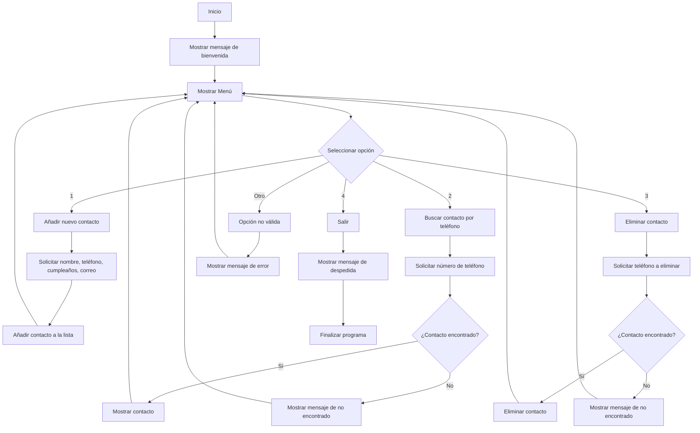

```mermaid
flowchart TD
    A[Inicio] --> B[Mostrar mensaje de bienvenida]
    B --> C[Mostrar Menú]
    C --> D{Seleccionar opción}
    D -->|1| E[Añadir nuevo contacto]
    D -->|2| F[Buscar contacto por teléfono]
    D -->|3| G[Eliminar contacto]
    D -->|4| H[Salir]
    D -->|Otro| I[Opción no válida]
    E --> J[Solicitar nombre, teléfono, cumpleaños, correo]
    J --> K[Añadir contacto a la lista]
    K --> C
    F --> L[Solicitar número de teléfono]
    L --> M{¿Contacto encontrado?}
    M -->|Sí| N[Mostrar contacto]
    M -->|No| O[Mostrar mensaje de no encontrado]
    N --> C
    O --> C
    G --> P[Solicitar teléfono a eliminar]
    P --> Q{¿Contacto encontrado?}
    Q -->|Sí| R[Eliminar contacto]
    Q -->|No| S[Mostrar mensaje de no encontrado]
    R --> C
    S --> C
    H --> T[Mostrar mensaje de despedida]
    T --> U[Finalizar programa]
    I --> V[Mostrar mensaje de error]
    V --> C
```